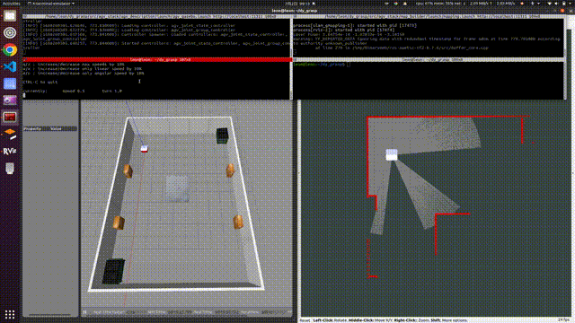
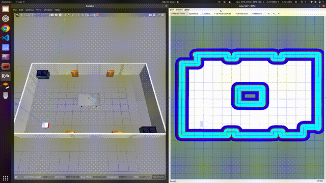
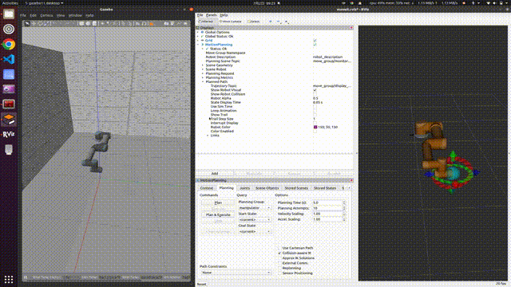

## 包介绍

此工作空间为移动机器人，机械臂和移动操作机器人基于gazebo的仿真环境搭建。

### agv_stack

移动机器人功能元包。

#### agv_description

移动机器人的模型可视化，gazebo控制器配置，其中移动机器人的运动使用`libgazebo_ros_control.so`驱动，并且将移动机器人等效成两个平动关节和一个转动关节，好处是便于对每个关节实施直接控制。

不同接口的对比参见`gazebo不同控制接口对比.md`文件

#### map_builder

基于gmapping的建图方法，配合teleop_twist_keyboard键盘控制。


#### agv_navigation

移动机器人导航，直接运动`roslaunch agv_navigation agv_navigation.launch`即可。注意通过`agv_control/agv_vel_controller`模拟出了`cmd_vel`接口，否则不能与`navigation`包契合；

#### agv_control

因为移动机器人的模型被等价成xy方向的平动和绕z轴的旋转，但是ros中的很多算法需要与`cmd_vel`交互，因此该包将接收`cmd_vel`消息，并转换成gazebo能够识别的消息，驱动移动机器人在(x,y,theta)上的运动；


### arm_stack

#### ur_description

ur机器人的模型可视化，gazebo控制器配置，其中机械臂使用的是位置接口。

#### ur_moveit_config

机械臂的moveit配置包。

### mm_stack

#### mm_description

移动操作机器人的模型可视化，gazebo控制器配置。

#### mm_moveit_config

移动操作机器人的moveit包。

## Tutorial

### 移动机器人建图

```
# 启动gazebo环境
roslaunch agv_description agv_gazebo.launch

# 启动建图算法
roslaunch map_builder mapping.launch

# 利用键盘控制小车运动，具体操作参考teleop_twist_keyboard包。或者直接向cmd_vel发送消息控制小车移动
rosrun teleop_twist_keyboard teleop_twist_keyboard.py

# 保存地图
rosrun map_server map_saver -f map.yaml      # 后面是地图的名称
```

### 移动机器人自主探索

```
# 启动gazebo环境
roslaunch agv_navigation agv_exploring.launch

# 启动建图算法
roslaunch map_builder mapping.launch

# 在rviz上使用箭头控制小车运动即可
```

### 移动机器人自主探索

```
# 启动gazebo环境
roslaunch agv_navigation agv_exploring.launch

# 启动建图算法
roslaunch map_builder mapping.launch

# 在rviz上使用箭头控制小车运动即可
```

效果如下图



### 移动机器人导航

```
# 启动gazebo环境和导航算法
roslaunch agv_navigation agv_navigation.launch

# 在rviz界面上点击2D Nav Goal指定目标点
```

效果如下图



### 机械臂Moveit

```
# 启动gazebo环境和moveit算法
roslaunch ur_moveit_config demo_gazebo.launch

# 在rviz中更新机械臂的目标点，然后点击plan and execute即可
```

效果如下图



### 复合机器人

```
# 启动复合机器人仿真环境和moveit算法
roslaunch mm_moveit_config demo_gazebo.launch

# 启动导航算法
roslaunch agv_navigation agv_navigation_impl.launch

# 在rviz中点击2D Nav Goal和Moveit的按钮，可以看到移动机器人导航和机械臂运动规划同时发生
```

效果如下图


## 修改注意事项

### Moveit包配置

用moveit_setup_assistant生成的包默认是无法进行gazebo仿真的（即rviz和gazebo中机器人不同步），核心是因为moveit会向指定的action发布轨迹消息，而该action的server需要由gazebo实现，来执行相应的轨迹。因此对于通过moveit_setup_assistant生成的包（Kinetic），需要进行以下修改（以ur_moveit_config为例）：

1. 将ros_controllers.yaml改成以下内容，其中关节名称根据实际情况更新，控制器的名称为`arm_traj_controller`（名字随意，不过需要记住）。
    ```
    controller_list:
    - name: arm_traj_controller
        action_ns: follow_joint_trajectory
        default: True
        type: FollowJointTrajectory
        joints:
        - shoulder_pan_joint
        - shoulder_lift_joint
        - elbow_joint
        - wrist_1_joint
        - wrist_2_joint
        - wrist_3_joint
    ```


2. 在config文件夹下面新建`gazebo_controllers.yaml`文件并填入以下内容，其中`arm_joint_state_controller`是gazebo需要启动的关节状态解析器，`arm_traj_controller`为需要启动的关节控制器，名称需要与`ros_controllers.yaml`中的控制器名称一致，否则moveit发送的消息类型不能被gazebo识别，那么就会出现rviz中的机器人运动，而gazebo中的机器人不动的情况；
    ```
    arm_joint_state_controller:
        type: joint_state_controller/JointStateController
        publish_rate: 50

    arm_traj_controller:
        type: position_controllers/JointTrajectoryController
        joints:
            - shoulder_pan_joint
            - shoulder_lift_joint
            - elbow_joint
            - wrist_1_joint
            - wrist_2_joint
            - wrist_3_joint
        constraints:
            goal_time: 0.6
            stopped_velocity_tolerance: 0.05
            shoulder_pan_joint: {trajectory: 0.1, goal: 0.1}
            shoulder_lift_joint : {trajectory: 0.1, goal: 0.1}
            elbow_joint: {trajectory: 0.1, goal: 0.1}
            wrist_1_joint: {trajectory: 0.1, goal: 0.1}
            wrist_2_joint: {trajectory: 0.1, goal: 0.1}
            wrist_3_joint: {trajectory: 0.1, goal: 0.1}
        stop_trajectory_duration: 0.5
        state_publish_rate:  25
        action_monitor_rate: 1
    ```
2. 修改`gazebo.launch`
    - 将`<param name="robot_description" textfile="$(arg urdf_path)" />`改成`<param name="robot_description" command="$(find xacro)/xacro $(arg urdf_path)" /> `;
    - 将`<include file="$(find dual_arm_moveit_config)/launch/ros_controllers.launch"/>`注释掉；
    - 加入下列语句，注意加载的控制器的名称需要与`gazebo_controllers.yaml`中的保持一致
        ```
        <rosparam file="$(find ur_moveit_config)/config/gazebo_controllers.yaml" command="load"/>
        <node name="controller_spawner" pkg="controller_manager" type="spawner" respawn="false"
            output="screen" args="arm_joint_state_controller arm_traj_controller"/>
        ```

